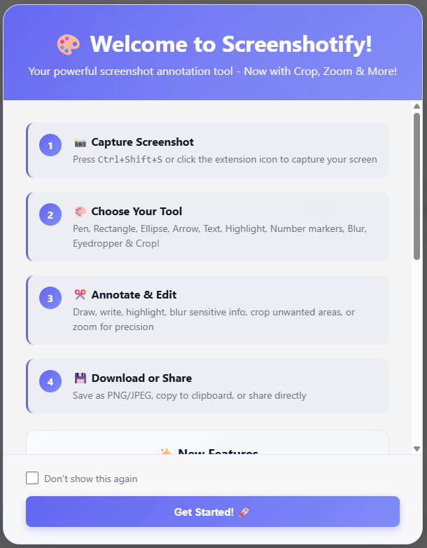

# Screenshotify

> Professional Screenshot & Annotation Chrome Extension

A fast, private, offline-first Chrome extension that captures screenshots and provides powerful annotation tools. Perfect for creating tutorials, bug reports, presentations, and documentation.



## ✨ Features

### 🎨 **Powerful Annotation Tools**
- **Pen Tool** - Free-hand drawing with customizable colors and thickness
- **Shapes** - Rectangle, ellipse, and arrow annotations
- **Text** - Add text labels with custom colors and sizes
- **Highlight** - Semi-transparent highlighting for emphasis
- **Number Markers** - Add numbered steps for tutorials
- **Blur Tool** - Pixelate sensitive information
- **Eyedropper** - Pick colors directly from your screenshot

### ✂️ **Advanced Editing**
- **Crop** - Trim screenshots to focus on important areas (with full undo support!)
- **Zoom** - Zoom in/out for precise editing (Ctrl + Mouse Wheel)
- **Undo/Redo** - Full history support (Ctrl+Z / Ctrl+Y)

### 🎯 **Key Features**
- ✅ **Offline & Private** - All processing happens locally in your browser
- ✅ **No Account Required** - Start using immediately
- ✅ **Keyboard Shortcuts** - Fast workflow with hotkeys
- ✅ **Modern UI** - Beautiful, intuitive interface with gradient design
- ✅ **High Quality** - PNG format for crisp screenshots
- ✅ **Quick Capture** - One-click screenshot capture

### 🔒 **Privacy First**
- ✅ **No data collection**
- ✅ **No external servers**
- ✅ **No tracking**
- ✅ **100% offline processing**
- ✅ **Your screenshots stay on your device**

## 🚀 Installation

### From Chrome Web Store
*Coming soon...*

### From Source (Development)

1. Clone this repository:
```bash
git clone https://github.com/carthworks/Screenshotify.git
cd Screenshotify
```

2. Load in Chrome:
   - Open Chrome and navigate to `chrome://extensions/`
   - Enable "Developer mode" (toggle in top right)
   - Click "Load unpacked"
   - Select the `Screenshotify` directory

## 📖 Usage

### Quick Capture

1. Click the Screenshotify icon in your toolbar
2. Click "Quick Capture" or press `Ctrl+Shift+S`
3. The screenshot opens in the annotation window

### Annotation Tools

| Tool | Description | Shortcut |
|------|-------------|----------|
| **Pen** | Free-hand drawing | `P` |
| **Rectangle** | Draw rectangular shapes | - |
| **Ellipse** | Draw circular/oval shapes | - |
| **Arrow** | Point to important areas | - |
| **Text** | Add text labels | - |
| **Highlight** | Semi-transparent highlighting | - |
| **Number** | Add numbered markers | - |
| **Blur** | Pixelate sensitive information | - |
| **Eyedropper** | Pick colors from screenshot | - |
| **Crop** | Trim the image | - |

### Keyboard Shortcuts

| Action | Shortcut |
|--------|----------|
| Capture Screenshot | `Ctrl+Shift+S` |
| Toggle Pen Tool | `P` |
| Undo | `Ctrl+Z` |
| Redo | `Ctrl+Y` |
| Zoom In | `Ctrl + Scroll Up` |
| Zoom Out | `Ctrl + Scroll Down` |
| Cancel | `Esc` |

*Customize shortcuts at `chrome://extensions/shortcuts`*

## 🎨 Annotation Features

### Drawing Tools
- **Pen** - Free-hand drawing with adjustable thickness and color
- **Shapes** - Rectangle, ellipse, and arrow with customizable colors
- **Text** - Add text with custom font size and color
- **Highlight** - Semi-transparent marker for emphasis

### Privacy Tools
- **Blur** - Pixelate sensitive information (adjustable strength)
- **Crop** - Remove unwanted areas (with undo!)

### Utility Tools
- **Eyedropper** - Pick any color from your screenshot
- **Number Markers** - Add numbered steps for tutorials
- **Zoom** - Zoom in for pixel-perfect annotations

### Editing Features
- **Undo/Redo** - Full history support with Ctrl+Z/Y
- **Color Picker** - Choose any color for annotations
- **Thickness Control** - Adjust pen and shape thickness
- **Font Size** - Customize text size

## ⚙️ Settings

Access settings by clicking the gear icon in the popup.

### General Settings
- **Image Format** - PNG (lossless) or JPEG (smaller)
- **JPEG Quality** - Compression level for JPEG
- **Blur Strength** - Default blur intensity (5-30)
- **Auto-downscale** - Resize large images for performance

### Appearance
- **Theme** - Light or dark mode (automatic)

## 🔒 Privacy & Security

- ✅ **All processing happens locally** in your browser
- ✅ **No data sent to external servers**
- ✅ **No tracking or analytics**
- ✅ **No user accounts or sign-in**
- ✅ **Open source** - inspect the code yourself
- ✅ **Manifest V3 compliant**

## 🛠️ Development

### Project Structure

```
Screenshotify/
├── manifest.json              # Extension manifest (MV3)
├── src/
│   ├── background/
│   │   └── service_worker.js  # Background service worker
│   ├── popup/
│   │   ├── popup.html         # Extension popup
│   │   ├── popup.css          # Modern gradient design
│   │   └── popup.js
│   ├── annotate/
│   │   ├── annotate.html      # Annotation interface
│   │   ├── annotate.css       # Annotation styles
│   │   └── annotate.js        # Annotation logic
│   ├── options/
│   │   ├── options.html       # Settings page
│   │   ├── options.css
│   │   └── options.js
│   ├── lib/
│   │   ├── canvas-utils.js    # Canvas operations & blur
│   │   └── upload.js          # Upload utilities
│   └── icons/
│       ├── icon16.svg
│       ├── icon48.svg
│       └── icon128.svg
└── README.md
```

### Building for Production

Create a ZIP file for Chrome Web Store submission:

```powershell
# Windows PowerShell
.\package-extension.ps1
```

Or manually:
```bash
# Create ZIP with manifest.json and src/ folder
zip -r Screenshotify.zip manifest.json src/
```

### Testing

1. Load the extension in Chrome:
   - Navigate to `chrome://extensions/`
   - Enable "Developer mode"
   - Click "Load unpacked"
   - Select the project directory

2. Test all features:
   - Capture screenshot
   - Try all annotation tools
   - Test crop and zoom
   - Test undo/redo
   - Test eyedropper
   - Test text input

## 📋 Chrome Web Store Submission

See [CHROME_STORE_SUBMISSION.md](CHROME_STORE_SUBMISSION.md) for detailed submission guide.

### Quick Checklist

- ✅ Manifest V3 compliant
- ✅ Privacy policy included
- ✅ All features tested
- ✅ Screenshots prepared (1280x800px)
- ✅ Store icon (128x128px)
- ✅ Detailed description ready

## 🎯 Use Cases

### Perfect For:
- 📚 **Creating tutorials** - Use number markers and arrows
- 🐛 **Bug reports** - Highlight issues and add annotations
- 📖 **Documentation** - Annotate screenshots for wikis
- 🎓 **Educational content** - Create step-by-step guides
- 💼 **Presentations** - Enhance slides with annotations
- 🔒 **Privacy** - Blur sensitive information before sharing

## 🆕 Recent Updates

### v1.0.0 (December 2024)
- ✅ Fixed text tool - now saves correctly
- ✅ Improved highlight tool - smooth continuous strokes
- ✅ Enhanced crop - full undo support with confirmation
- ✅ Better popup UI - modern gradient design
- ✅ Eyedropper fix - instant color picking
- ✅ Service worker fix - thumbnail generation
- ✅ Removed OCR - focused on core annotation features

## 🤝 Contributing

Contributions are welcome! Please feel free to submit a Pull Request.

### How to Contribute:
1. Fork the repository
2. Create a feature branch (`git checkout -b feature/AmazingFeature`)
3. Commit your changes (`git commit -m 'Add some AmazingFeature'`)
4. Push to the branch (`git push origin feature/AmazingFeature`)
5. Open a Pull Request

## 📄 License

MIT License - see [LICENSE](LICENSE) file for details

## 🙏 Acknowledgments

- Chrome Extension APIs
- Canvas API for drawing and image manipulation
- All contributors and users

## 📞 Support

- **Issues**: [GitHub Issues](https://github.com/carthworks/Screenshotify/issues)
- **Discussions**: [GitHub Discussions](https://github.com/carthworks/Screenshotify/discussions)

## 🗺️ Roadmap

### Planned Features:
- [ ] Full-page screenshot capture (scroll capture)
- [ ] Video recording
- [ ] More annotation shapes (triangle, star, line)
- [ ] Custom color palettes
- [ ] Export to PDF
- [ ] Batch processing
- [ ] Cloud sync (optional)
- [ ] Collaboration features

### Completed:
- [x] Basic screenshot capture
- [x] All annotation tools
- [x] Crop with undo
- [x] Zoom functionality
- [x] Blur tool
- [x] Eyedropper
- [x] Modern UI
- [x] Keyboard shortcuts
- [x] History management

## 💡 Tips & Tricks

### Pro Tips:
- **Use number markers** for step-by-step guides
- **Pick colors with eyedropper** for brand consistency
- **Blur sensitive information** before sharing screenshots
- **Zoom in** for pixel-perfect annotations
- **Use Ctrl+Z** to undo mistakes
- **Crop with confirmation** to avoid accidental crops

### Keyboard Workflow:
1. `Ctrl+Shift+S` - Capture
2. `P` - Switch to pen
3. Draw annotations
4. `Ctrl+Z` - Undo if needed
5. Download or copy

---

**Made with ❤️ for productivity and privacy**

⭐ Star this repo if you find it useful!
